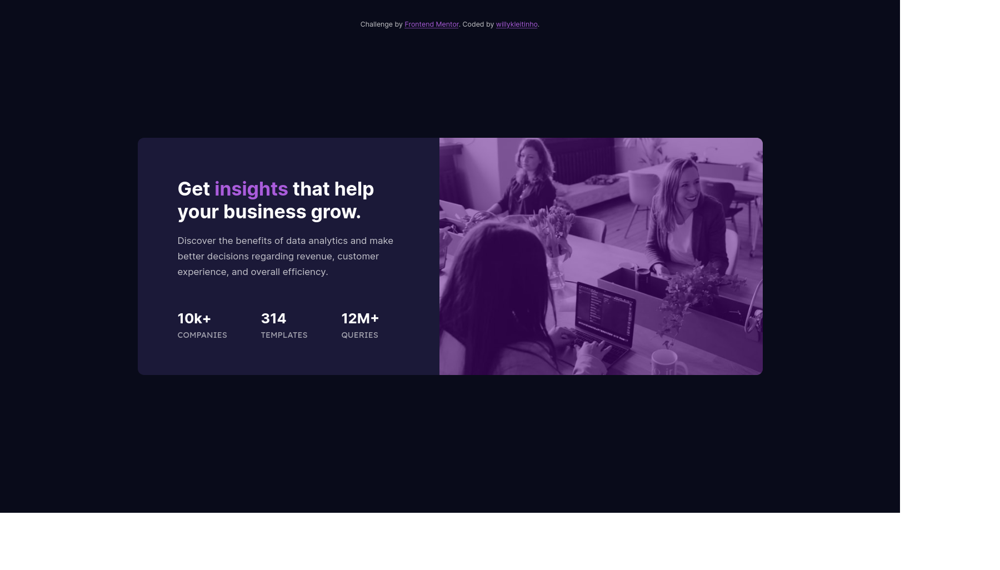

# Frontend Mentor - Stats preview card component solution

This is a solution to the [Stats preview card component challenge on Frontend Mentor](https://www.frontendmentor.io/challenges/stats-preview-card-component-8JqbgoU62). Frontend Mentor challenges help you improve your coding skills by building realistic projects. 

## Table of contents

- [Overview](#overview)
  - [The challenge](#the-challenge)
  - [Screenshot](#screenshot)
  - [Links](#links)
- [My process](#my-process)
  - [Built with](#built-with)
  - [What I learned](#what-i-learned)
  - [Continued development](#continued-development)
  - [Useful resources](#useful-resources)
- [Author](#author)

## Overview

### The challenge

Users should be able to:

- View the optimal layout depending on their device's screen size

### Screenshot

### Links

- Solution URL: [Frontend Mentor](https://www.frontendmentor.io/solutions/mobilefirst-and-bem-practice-yGMZ1ZyP7)
- Live Site URL: [Github Pages](https://willykleitinho.github.io/stat-preview-card-component/)

## My process

### Built with

- CSS custom properties
- BEM methodology
- Flexbox
- Mobile-first workflow

### What I learned

In this quick project I practiced the BEM methodology for CSS, as well as mobile-first workflow, using flexbox.

### Continued development

Working with BEM makes some things way easier, I'll definitely learn more about it and other methodologies as well. 

### Useful resources

- [Desenvolvimento para Web (pt-br)](https://desenvolvimentoparaweb.com/css/bem/) - Quick explanation on BEM.

## Author

- Website - [willykleitinho](https://willykleitinho.github.io/stat-preview-card-component/)
- Frontend Mentor - [@willykleitinho](https://www.frontendmentor.io/profile/willykleitinho)
